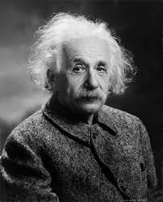

---
hide:
  - navigation
  - toc
---

<section class="hero-section">
  

    <h1 class="hero-title">Welcome to Physics Daily</h1>
    
A comprehensive physics study resource covering all major topics. Master the fundamentals and explore advanced concepts with clear explanations and interactive content.

    <a href="understand-physics/" class="hero-button">Let's Understand Physics</a>
  

  

    
    
"The important thing is not to stop questioning. Curiosity has its own reason for existing."

    &mdash; Albert Einstein
  

</section>

## Contents

-   [**Mechanics**](mechanics/index.md)

    Motion, forces, energy, momentum, and rotational dynamics

-   [**Waves & Acoustics**](waves/index.md)

    Mechanical waves, sound, and wave phenomena

-   [**Thermodynamics**](thermodynamics/index.md)

    Heat, temperature, and the laws of thermodynamics

-   [**Electromagnetism**](electromagnetism/index.md)

    Electric and magnetic fields, circuits, and EM waves

-   [**Optics**](optics/index.md)

    Light, reflection, refraction, interference, and diffraction

-   [**Modern Physics**](modern/index.md)

    Relativity, quantum mechanics, and particle physics

