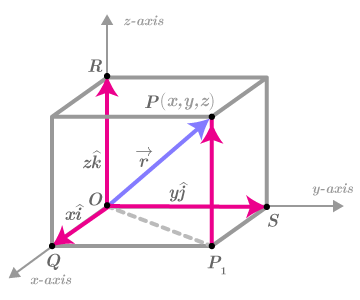

## Position

In mechanics, position simply denotes where a particle is in space. It is a **vector quantity** which means to define it we need its magnitude and direction. The position of a particle is defined with respect to the origin or with respect to the observer. One thing to note is that the observer is usually treated to be at the origin for simplicity. It is generally represented by $\vec{r}$ (or in bold as **r**). We can simply understand the position vector as a vector drawn from origin to the point where particle is located. The position of a particle can be defined either in 1 dimension, 2 dimensions or 3 dimensions. We will discuss motion in different dimensions later.

 

**The position of a particle in 3D is defined as:**
 > $$\vec{r} = x\hat{i} + y\hat{j} + z\hat{k}$$

The magnitude refers to length of the vector or distance of the particle from the origin or from the observer. Given the coordinates of a particle (and observer if not in origin), the magnitude (or length) of the position vector is calculated as:
$$r = |\vec{r}| = \sqrt{x^2 + y^2 + z^2}$$

